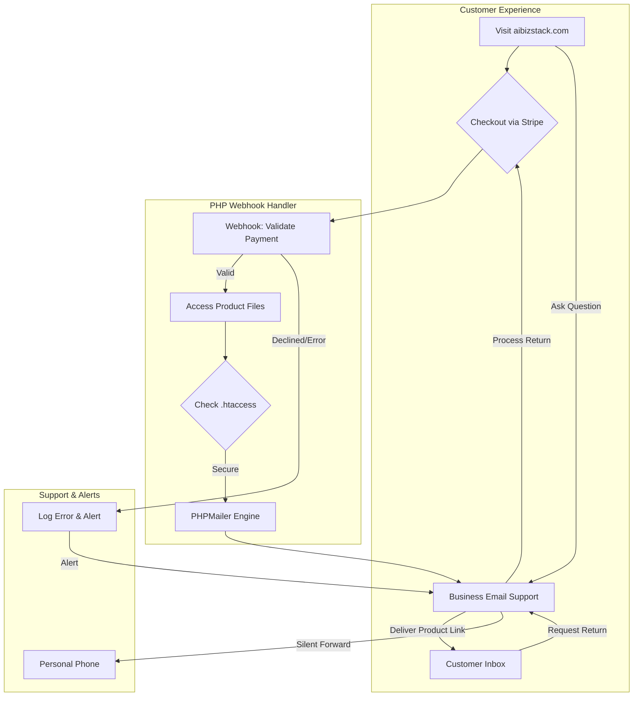

System Security & Governance
Access Control: Uses .htaccess server-side rules to prevent unauthorized direct linking to digital assets.
Validation: Webhook-driven PHP handler ensures product delivery only occurs after verified Stripe success events.
Sandbox Tested: Architecture validated in a hardware-isolated environment to ensure 100% stability before production deployment.
