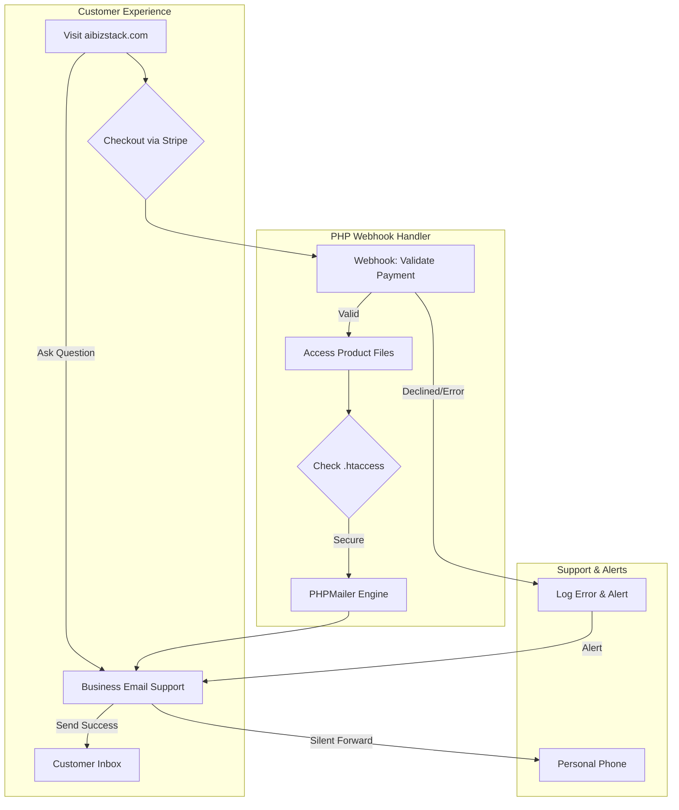

```mermaid
graph TD
    subgraph Customer_Side [Customer Experience]
        A[Visit aibizstack.com] --> B{Checkout via Stripe}
        D[Customer Inbox]
        A -- Ask Question --> N
    end

    subgraph Logic_Layer [PHP Webhook Handler]
        B --> E[Webhook: Validate Payment]
        E -- Valid --> F[Access Product Files]
        F --> H{Check .htaccess}
        H -- Secure --> I[PHPMailer Engine]
        I --> N[Business Email Support]
    end

    subgraph Monitoring_Layer [Support & Alerts]
        N[Business Email Support] -- Send Success --> D
        N -- Silent Forward --> L[Personal Phone]
        E -- Declined/Error --> G[Log Error & Alert]
        G -- Alert --> N
    end
```
